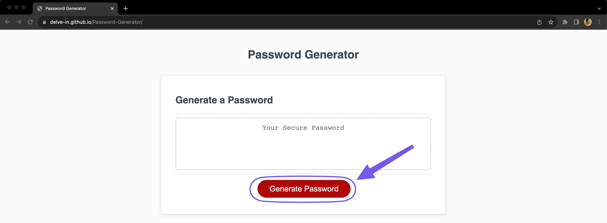
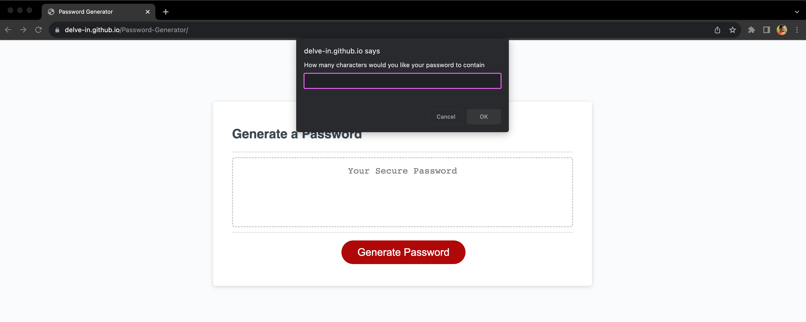
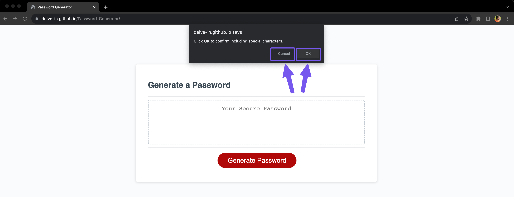
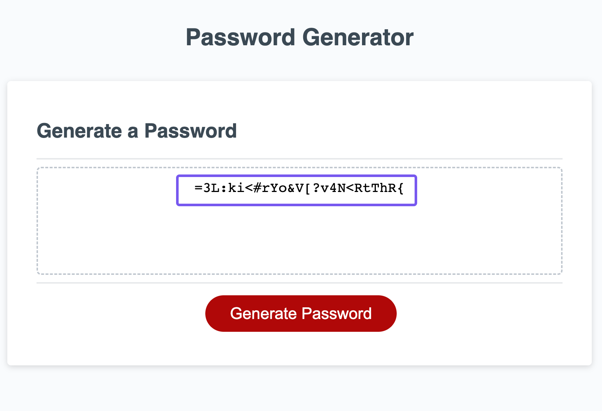

# Password-Generator

## Description

Website used for generating random password as per the user inputs. 

## Installation

N/A

## Usage

Click the Generate Password button to start. 

Once the Generate Password is clicked user is presented with a series of prompts for password criteria first of that is a dialogue box asking "How many characters would you like your password to contain".

User can enter any value between 8 to 128 and press OK to continue or Cancel to stop. The entered value will be the length of the password. If the entered value is not in between 8 to 128, User will be prompted with a message "Password length must be at least 8 characters" or "Password length must be at max 128 characters" accordingly. User can press OK and will be able to re-enter the value.

Once a valid input is recieved user will be prompted to select which of the character types to be included in the password. By clicking OK or Cancel user can choose which of the character types to be included.

If the user doesn't select any character type there will be a message "Password must contain at least one character type", User can press okey and can again select the character types to be included.

Once user has given valid inputs a random password is generated according to the inputs by user and displayed in the window.

User can click the Generate Password button again to restart the process.

## Credits

N/A

## License

MIT License

## Deployed applicatin link

https://delve-in.github.io/Password-Generator/